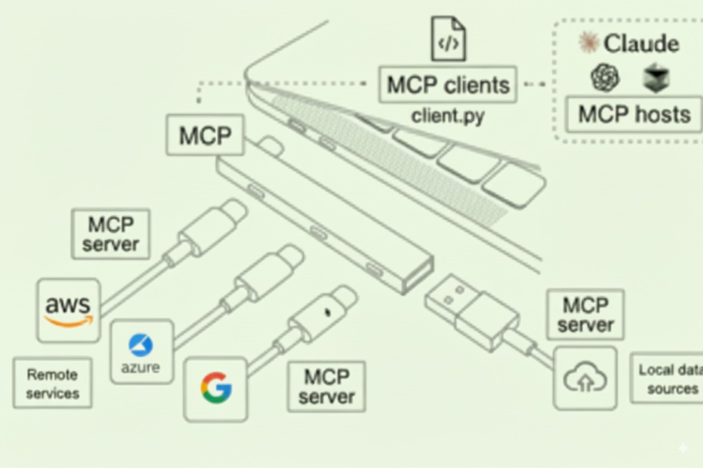

# AI for FinOps - Cloud FinOps MCP Resources

> Practical **Model Context Protocol (MCP)** resources for **Cloud FinOps**: pricing, budgets, anomaly checks, automation — with security guardrails.

---

## 🎉 Recent Updates (January 2026)

This repository is **up-to-date as of January 2026** with the latest MCP developments:

- **Tutorial Updates (December 2025)** - Major improvements across all quickstart tutorials:
  - **GCP BigQuery Tutorial** - Added local vs remote MCP comparison, fixed video embedding, improved setup instructions
  - **AWS Kiro CLI Tutorial** - Renamed from "Amazon Q" for clarity, enhanced installation steps
  - **Azure MCP Tutorial** - Added critical clarification that official Azure MCP lacks cost/billing APIs, comprehensive comparison of community alternatives with production-readiness assessment, and Cline-specific configuration guidance
- **AWS MCP Server Unified Architecture** - New consolidated server announced November 2025 with access to 15,000+ AWS APIs, Agent SOPs, and AWS's first remote MCP server ([learn more](./servers/aws.md))
- **MCP Specification 2025-11-25** - Task workflows, enhanced OAuth PKCE, client credentials, and cross-app authorization ([architecture guide](./foundations/mcp-architecture.md))
- **Linux Foundation Donation** - MCP donated to Agentic AI Foundation (December 2025) with support from Anthropic, OpenAI, Google, Microsoft, AWS, and others ([details](./foundations/what-is-mcp.md))
- **New Client Documentation** - Added guides for ChatGPT, Gemini, Copilot, Claude Code, and Kiro - now covering all 9 major MCP clients ([view all clients](./clients/))
- **Enhanced Security** - Updated security best practices for MCP 2025-11-25 spec with remote MCP deployment guidance ([security docs](./governance/))
- **Improved Navigation** - Reorganized repository structure with INDEX files for better discoverability ([see CHANGELOG](./CHANGELOG.md))

---

## 🚀 Start Here
- ✅ [Download a client](clients/comparison.md)
- ✅ [Run your first MCP](tutorials/01-aws-pricing-quickstart.md)
- ✅ [Explore the FinOps MCPs and pick the one that best fits your use case](servers/)

---

## 📂 Repository Structure

- [/foundations](./foundations) → background notes, whitepapers, blog summaries
- [/servers](./servers) → registry of available MCP servers (pricing, tagging, governance)
- [/clients](./clients) → tested MCP clients (Claude, Cursor, VS Code, Q, etc.)
- [/tutorials](./tutorials) → runnable guides (step by step)
- [/use-cases](./use-cases) → applied scenarios (budgeting, anomaly detection, tagging compliance)
- [/governance](./governance) → security checklists, threat models, deployment guidance
- [/presentations](./presentations) → slides, abstracts, LinkedIn drafts
- [/resources](./resources) → external links (FinOps WG docs, repos, talks, videos)  

---

## 🧩 What is MCP?

*MCP connects AI clients to multiple data sources and services through a standardized protocol*

MCP is an **open standard protocol** that lets **LLMs act as agents** by safely connecting to external tools (servers) like AWS Cost Explorer, a GCP BigQuery dataset with billing exports, an Azure storage account holding cost data, or 3rd-party cloud finops solutions like Vantage.

**Industry Adoption (January 2026)**:
In December 2025, Anthropic donated MCP to the **Agentic AI Foundation** (Linux Foundation), with founding support from Anthropic, Block, and OpenAI, plus backing from Google, Microsoft, AWS, Cloudflare, and Bloomberg. This ensures MCP remains open, neutral, and community-driven as critical AI infrastructure.

As of January 2026, the ecosystem has grown to **10,000+ active MCP servers** and is now supported by major AI platforms including ChatGPT, Claude, Gemini, Microsoft Copilot, VS Code, Cursor, Kiro, and Amazon Q.

In FinOps, MCP unlocks:
- Faster cost simulations
- Real-time tagging compliance
- Forecasting and Cost Simulations
- Cost Optimization recommendations

But also raises **governance and security** challenges — this repo addresses both sides.

---

## 🛠️ Contributing
We welcome contributions:
1. Fork the repo and create a branch
2. Add your MCP server, tutorial, or use case
3. Open a PR with a clear description  

See [CONTRIBUTING.md](CONTRIBUTING.md) for details.  
New to MCP or FinOps? Start with issues labeled **good first issue**.

---

## 🔐 Governance
- [Code of Conduct](CODE_OF_CONDUCT.md)  
- [License](LICENSE)  

---

## 🌍 Community
- Join discussions in the [FinOps Foundation Slack](https://www.finops.org/slack/)  
- Follow updates on [LinkedIn](https://linkedin.com/in/jeanlatiere)  
- Share your use cases, raise issues, propose servers  

---

## 📜 License
This project is licensed under the [Apache 2.0 License](LICENSE).
