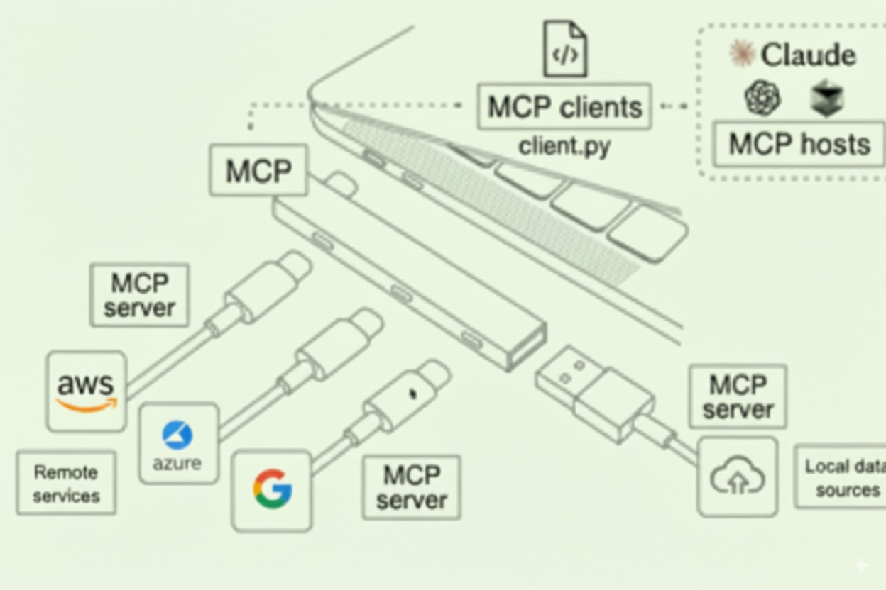

# AI for FinOps — Cloud Cost Optimization with MCP

> Open-source **Model Context Protocol (MCP)** resources for **Cloud FinOps**: cloud cost optimization, AI cost management, FinOps automation, tagging governance, cost anomaly detection, and budget monitoring — across AWS, Azure, and GCP.

---

## What is this repository?

A practical resource hub for FinOps practitioners, cloud engineers, and platform teams who want to use **AI agents** to automate cloud cost optimization. This repo provides tutorials, MCP server documentation, client guides, and security frameworks for implementing the Model Context Protocol across AWS, Azure, and GCP.

**19 MCP servers documented** | **7 step-by-step tutorials** | **9 MCP clients compared** | **3 cloud providers covered**

---

## How do I get started?

1. **[Choose an MCP client](clients/comparison.md)** — Claude, ChatGPT, Gemini, Copilot, Cursor, Kiro, VS Code
2. **[Run your first MCP tutorial](tutorials/01-aws-pricing-quickstart.md)** — query real-time AWS pricing in 15 minutes
3. **[Explore all FinOps MCP servers](servers/)** — AWS, Azure, GCP, Tagging, JIRA, Slack

---

## Recent Updates (July 2026)

- **MCP Specification 2026-07-28** (July 28, 2026) — MCP's biggest redesign since launch, now rolling out across Claude. A **stateless core** (the `initialize`/`initialized` handshake and `Mcp-Session-Id` header are retired) lets remote FinOps servers run on serverless / scale-to-zero infrastructure; **MCP Tasks** (long-running jobs) and **MCP Apps** (interactive in-chat UI) graduate into a versioned extensions framework; and authorization aligns with OAuth 2.0 / OIDC (Microsoft Entra, Okta) via an **Enterprise Managed Authorization** extension. Updated: [architecture](./foundations/mcp-architecture.md), [remote servers](./governance/remote-mcp-servers.md), [auth vulnerabilities](./governance/mcp-authentication-vulnerabilities-2026.md). Sources: [Anthropic](https://claude.com/blog/bringing-mcp-2026-07-28-to-claude), [MCP spec blog](https://blog.modelcontextprotocol.io/posts/2026-07-28/).
- **Azure FinOps MCP Server (public preview)** (June 23, 2026) — Microsoft's first official FinOps-branded MCP server, the cost-and-usage packaging of the **ARM MCP Server** (preview since May 7). Natural-language Azure Resource Graph queries for estate-wide waste detection; the official `@azure/mcp` server also gained a retail pricing tool for pre-deployment cost estimation. Updated: [server doc](./servers/azure.md), [tutorial](./tutorials/04-azure-mcp-quickstart.md). Source: [Azure Blog](https://azure.microsoft.com/en-us/blog/from-insight-to-action-the-next-phase-of-agentic-cloud-operations/).
- **AWS MCP Server GA** (May 6, 2026) — Now part of the broader Agent Toolkit for AWS. The previous `aws-mcp:InvokeMcp` permission is replaced by standard IAM policies using the `aws:ViaAWSMCPService` and `aws:CalledViaAWSMCP` context keys. New `run_script` tool runs short Python scripts in a server-side sandbox for multi-step workflows. Frankfurt (`eu-central-1`) endpoint added alongside `us-east-1`. Updated: [tutorial](./tutorials/07-aws-mcp-remote-server.md), [server doc](./servers/aws.md).
- **Google managed MCP servers GA** (April 29, 2026): more than 50 official Google MCP servers across infrastructure, databases, analytics, storage, and Workspace APIs (BigQuery, Cloud Run, Apigee, AlloyDB, Spanner, Firestore, GKE). Updated: [server doc](./servers/gcp.md).
- **New: Workflow & Collaboration Servers** — [FinOps Tagging Compliance](./servers/tagging.md), [JIRA](./servers/jira.md), and [Slack](./servers/slack.md) MCP servers for automated cost governance
- **Registry Backfill** — [`registry.yaml`](./servers/configs/registry.yaml) machine-readable registry, now at 18 entries with the ARM MCP Server addition
- **MCP Authentication Vulnerabilities** (refreshed May 2026): critical security risks plus 2 new 2026 CVEs (CVE-2026-0621 in the TypeScript SDK, CVE-2026-40933 in Flowise) ([read more](./governance/mcp-authentication-vulnerabilities-2026.md))
- **MCP Dev Summit North America 2026** (NYC): AAIF reported 1,200 attendees, 110+ million monthly SDK downloads, and 170 member organizations. Headline disclosures: a DNS rebinding attack class against MCP servers (Jonathan Leitschuh / Braise) and Amazon's "lethal trifecta" pattern for scanning agent configurations. Source: [AAIF blog](https://aaif.io/blog/mcp-is-now-enterprise-infrastructure-everything-that-happened-at-mcp-dev-summit-north-america-2026/)

---

## What's inside?

| Section | What you'll find |
|---------|-----------------|
| [/foundations](./foundations) | What is MCP, how it works, architecture deep-dive |
| [/servers](./servers) | 19 MCP servers — AWS, Azure, GCP, Tagging, JIRA, Slack |
| [/clients](./clients) | 9 MCP clients compared — Claude, ChatGPT, Gemini, Copilot, Cursor, Kiro |
| [/tutorials](./tutorials) | 7 step-by-step guides for AWS, Azure, GCP cost analysis |
| [/governance](./governance) | Security best practices, IAM policies, vulnerability guides |

---

## What is MCP and why does it matter for FinOps?

*MCP connects AI clients to cloud cost management tools through a standardized protocol*

The **Model Context Protocol (MCP)** is an open standard that lets AI agents securely connect to external tools — like AWS Cost Explorer, GCP BigQuery billing exports, Azure Cost Management, or third-party FinOps platforms like Vantage. It's the bridge between "ask a question about cloud spend" and "get a real answer from live data."

**Industry Adoption (July 2026)**: MCP was donated to the **Linux Foundation** (December 2025) with backing from Anthropic, OpenAI, Google, Microsoft, and AWS. At [MCP Dev Summit North America 2026](https://aaif.io/blog/mcp-is-now-enterprise-infrastructure-everything-that-happened-at-mcp-dev-summit-north-america-2026/) in New York City (May 2026), the **Agentic AI Foundation** reported **1,200 attendees** (doubled from the previous summit), **110+ million monthly SDK downloads**, and **170 member organizations** in under 4 months. Growth has since accelerated: at the **July 28, 2026** specification release, Anthropic reported MCP passing **400+ million monthly SDK downloads** (≈4× year-over-year), with **950+ servers** listed in Claude's connector directory. All major AI platforms now support MCP.

### What can MCP do for cloud cost optimization?

- **Cost anomaly detection** — AI agents query Cost Explorer and alert on spend spikes
- **Tagging compliance** — automated audits of tag coverage and drift detection
- **Resource optimization** — rightsizing recommendations, idle resource identification
- **Budget monitoring** — real-time threshold alerts via Slack, JIRA ticket creation
- **Multi-cloud cost analysis** — unified queries across AWS, Azure, and GCP
- **Cost simulation** — what-if scenarios for commitment purchases and architecture changes

But MCP also raises **governance and security** challenges — this repo addresses both.

---

## Contributing

We welcome contributions — new MCP servers, tutorials, use cases, and security guidance.

1. Fork the repo and create a branch
2. Add your content
3. Open a PR with a clear description

See [CONTRIBUTING.md](CONTRIBUTING.md) for details. New to MCP or FinOps? Start with issues labeled **good first issue**.

---

## Community

- [FinOps Foundation Slack](https://www.finops.org/slack/)
- [LinkedIn](https://linkedin.com/in/jeanlatiere)
- [Code of Conduct](CODE_OF_CONDUCT.md) | [License (Apache 2.0)](LICENSE)
