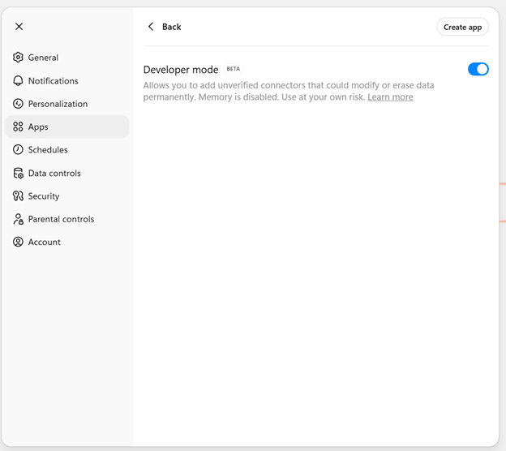

← [Back to Clients](./INDEX.md) | [Home](../README.md) | [Comparison Guide](./comparison.md)

---

# ChatGPT (OpenAI)

**Download ChatGPT**: https://openai.com/chatgpt/download

ChatGPT is OpenAI's conversational AI assistant that added native MCP support in March 2025, enabling connections to external tools, databases, and APIs for FinOps workflows.

## MCP Support Timeline
- **March 2025**: Official MCP adoption across ChatGPT desktop app, OpenAI Agents SDK, and Responses API
- **December 2025**: OpenAI co-founded the Agentic AI Foundation (AAIF) alongside Anthropic and Block

---

## Compatibility & Transport Requirements (Important)

ChatGPT can connect to MCP servers **only if they are exposed as remote HTTP services**.

Specifically:
- ChatGPT does **not** support local `stdio` MCP servers
- MCP servers must support **Streamable HTTP** or **HTTP/SSE**
- The MCP server must be reachable over **public HTTPS**
- Authentication must match ChatGPT workspace policy (OAuth or None)

Many MCP servers (including several in awslabs/mcp) are `stdio`-only by default and **cannot be used directly with ChatGPT** without deploying an HTTP wrapper or proxy.

---
## ChatGPT Pros and Cons with MCPs

✅ **Pros for a Cloud FinOps professional**
- **Massive user base**: ChatGPT's popularity makes FinOps insights accessible to non-technical stakeholders.
- **MCP-native**: Direct integration with AWS, Azure, GCP pricing servers, cost explorers, and custom FinOps tools.
- **Multi-modal**: Can process cost reports, charts, spreadsheets, and generate visualizations.
- **API access**: Programmatic integration via OpenAI Agents SDK and Responses API for automation.
- **Enterprise offering**: ChatGPT Enterprise provides better security, compliance, and data privacy controls.
- **Fast prototyping**: Quick "what if" scenarios for cost simulations and forecasting.

⚠️ **Cons for a Cloud FinOps professional**
**Technical**
- Remote MCP only (no local stdio)
- Token and rate limits on large billing datasets
- Not designed for audit trails or approvals
**Cost & Governance**
- MCP requires Plus or Enterprise tiers
- Data privacy and residency must be assessed
**Model Risk**
- Model variability across GPT versions
- Hallucination risk requires validation against source data

---

### MCP Access Modes

- **ChatGPT UI**: MCP connections are available only in **Developer Mode**
- **OpenAI API**: MCP can be used programmatically via the **Responses API** or **Agents SDK**, without ChatGPT Developer Mode

---

### Desktop App Configuration

For our configuration we will use the [AWS Knowledge MCP Server](https://awslabs.github.io/mcp/servers/aws-knowledge-mcp-server), which uses HTTP transport and does not require authentication (rate-limited).  

1. **Open ChatGPT Settings → Apps → Advanced Settings → Developer mode**
   
   
   
   *Navigate to Settings, Apps, Advanced Settings and select the Integrations tab*

   

2. **Add MCP Server Configuration**

   
   
   
   *Configure your MCP server connection using the API endpoint [AWS Knowledge MCP Server](https://knowledge-mcp.global.api.aws)*
   

3. **Verify Connection**
   
   
   
   *ChatGPT shows available MCP tools when successfully connected*

---   

### Using MCP Tools

Once configured, you can query MCP servers directly in your ChatGPT conversations and test with a prompt that forces tool usage.

*Example: In which regions are the Graviton 5 instances deployed?*

--- 

### API Configuration

1. **Agents SDK**: Programmatically connect MCP servers to custom agents. It’s the right choice if you want a richer agent runtime (state, orchestration, tool policies), and not just “one request → one response.”
   
2. **Responses API**: Use MCP tools in API responses for automation workflows: the Responses API can call remote MCP servers directly, as part of a single response “agentic loop.” It supports remote MCP servers over Streamable HTTP or HTTP/SSE only. Conceptually, you pass an MCP server in tools, the API imports the tool list from that server, then the model can invoke those tools; you’ll see outputs like mcp_list_tools and tool call items in the response.

Refer to [OpenAI's MCP documentation](https://platform.openai.com/docs/guides/tools-connectors-mcp) for detailed setup instructions.

---

## FinOps Use Cases

**Recommended for:**
- Democratizing FinOps data access for finance teams and executives
- Quick cost comparisons and "what if" analyses
- Generating cost narrative reports from raw billing data
- Prototyping FinOps automations before production deployment

**Not recommended for:**
- Production cost optimization workflows requiring audit trails
- Scenarios where data residency/privacy regulations prohibit cloud AI services
- Real-time cost anomaly detection (latency and rate limits)

---

## MCP Transport Types Explained

ChatGPT and the OpenAI API can only connect to MCP servers that expose **remote HTTP transports**. Two variants are supported.

### Streamable HTTP (Recommended)

Streamable HTTP is the modern MCP transport for remote servers.

- MCP messages are exchanged over standard HTTPS requests
- The server may stream responses incrementally
- Works well with load balancers, serverless platforms, and cloud deployments
- Easier to secure, observe, and scale

This is the **preferred transport** for production MCP servers.

### HTTP/SSE (Legacy but supported)

HTTP/SSE uses Server-Sent Events:

- The client sends requests via HTTP
- The server keeps a long-lived SSE connection open to stream responses
- Some older MCP servers still use this model

This transport is still supported but may be harder to operate behind corporate proxies or firewalls.

### What is not supported by ChatGPT

- Local `stdio` MCP servers
- CLI-based MCP execution (`npx`, `uvx`, Docker)
- File-based or socket-based transports

If your MCP server is `stdio`-only, you must deploy a remote HTTP wrapper to use it with ChatGPT.

---

## Related Resources
- [All MCP Clients](./INDEX.md) - Overview of 9 clients
- [Client Comparison Guide](./comparison.md) - Detailed pros/cons
- [ChatGPT Official Website](https://openai.com/chatgpt)
- [Security Best Practices](../governance/security-best-practices-2025.md)
- [Getting Started Guide](../foundations/getting-started.md)

---

← [Previous: Claude Desktop](./claude-desktop.md) | [Next: Google Gemini](./gemini.md) →
