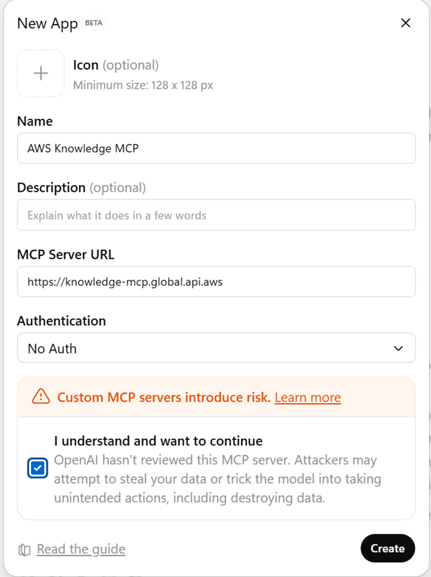
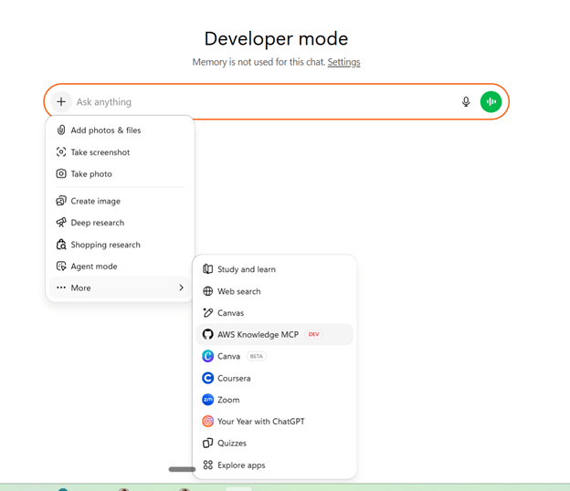
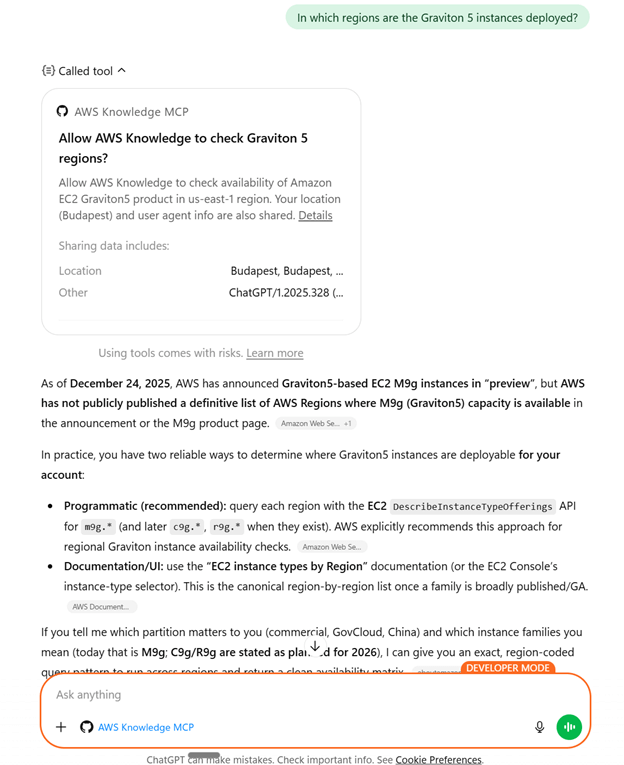

← [Back to Clients](./INDEX.md) | [Home](../README.md) | [Comparison Guide](./comparison.md)

---

# ChatGPT (OpenAI)

**Download ChatGPT**: https://openai.com/chatgpt/download

ChatGPT is OpenAI's conversational AI assistant that added native MCP support in March 2025, enabling connections to external tools, databases, and APIs for FinOps workflows.

## MCP Support Timeline
- **March 2025**: Official MCP adoption across ChatGPT desktop app, OpenAI Agents SDK, and Responses API
- **December 2025**: OpenAI co-founded the Agentic AI Foundation (AAIF) alongside Anthropic and Block

---

✅ **Pros for a Cloud FinOps professional**
- **Massive user base**: ChatGPT's popularity makes FinOps insights accessible to non-technical stakeholders.
- **MCP-native**: Direct integration with AWS, Azure, GCP pricing servers, cost explorers, and custom FinOps tools.
- **Multi-modal**: Can process cost reports, charts, spreadsheets, and generate visualizations.
- **API access**: Programmatic integration via OpenAI Agents SDK and Responses API for automation.
- **Enterprise offering**: ChatGPT Enterprise provides better security, compliance, and data privacy controls.
- **Fast prototyping**: Quick "what if" scenarios for cost simulations and forecasting.

⚠️ **Cons for a Cloud FinOps professional**
- **Subscription costs**: MCP features require ChatGPT Plus ($20/month) or Enterprise tier.
- **Only in Developper Mode**: as of now,ChatGPT can only connect to external MCP servers when Developer mode is enabled.
- **Only connectes to remote MCP servers over SSE or streaming HTTP**: So you must pick an AWS MCP that is already exposed as HTTPS streaming HTTP, or you must deploy one yourself.
- **Token/rate limits**: Large billing exports or multi-cloud queries can hit usage caps.
- **Data privacy concerns**: Sending cost data to OpenAI requires careful compliance review.
- **Limited audit trails**: Not designed as a governance or approval layer for FinOps decisions.
- **Model variability**: GPT-4 vs GPT-4o vs o1 — different models have different MCP capabilities and costs.
- **Hallucination risk**: Outputs feel authoritative but need validation against source billing data.

---

## MCP Configuration

ChatGPT supports MCP servers through the ChatGPT Developper Mode. The key point: ChatGPT Developer mode only connects to remote MCP servers over SSE or streaming HTTP.

### Desktop App Configuration

1. **Open ChatGPT Settings → Apps → Advanced Settings → Developer mode**
   
   *Navigate to Settings, Apps, Advanced Settings and select the Integrations tab*

2. **Add MCP Server Configuration**
   
   *Configure your MCP server connection (AWS Pricing, Cost Explorer, etc.)*

3. **Verify Connection**
   
   *ChatGPT shows available MCP tools when successfully connected*

### Using MCP Tools

Once configured, you can query MCP servers directly in your ChatGPT conversations:

*Example: ChatGPT querying AWS Pricing API through MCP*

### API Configuration

2. **Agents SDK**: Programmatically connect MCP servers to custom agents
3. **Responses API**: Use MCP tools in API responses for automation workflows

Refer to [OpenAI's MCP documentation](https://platform.openai.com) for detailed setup instructions.

---

## FinOps Use Cases

**Recommended for:**
- Democratizing FinOps data access for finance teams and executives
- Quick cost comparisons and "what if" analyses
- Generating cost narrative reports from raw billing data
- Prototyping FinOps automations before production deployment

**Not recommended for:**
- Production cost optimization workflows requiring audit trails
- Scenarios where data residency/privacy regulations prohibit cloud AI services
- Real-time cost anomaly detection (latency and rate limits)

---

👉 **In short**: ChatGPT + MCP makes cloud cost data conversational and accessible to business users, but requires careful evaluation of data governance, subscription costs, and hallucination risks before enterprise rollout.

---

## Related Resources
- [All MCP Clients](./INDEX.md) - Overview of 9 clients
- [Client Comparison Guide](./comparison.md) - Detailed pros/cons
- [ChatGPT Official Website](https://openai.com/chatgpt)
- [Security Best Practices](../governance/security-best-practices-2025.md)
- [Getting Started Guide](../foundations/getting-started.md)

---

← [Previous: Claude Desktop](./claude-desktop.md) | [Next: Google Gemini](./gemini.md) →
