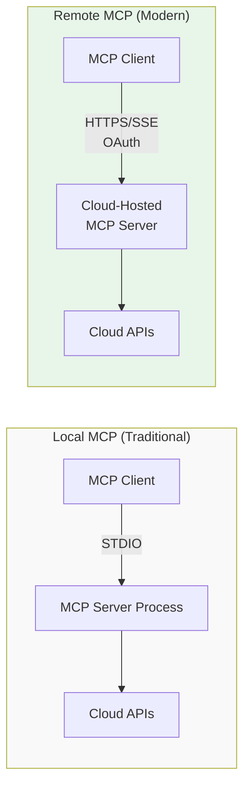
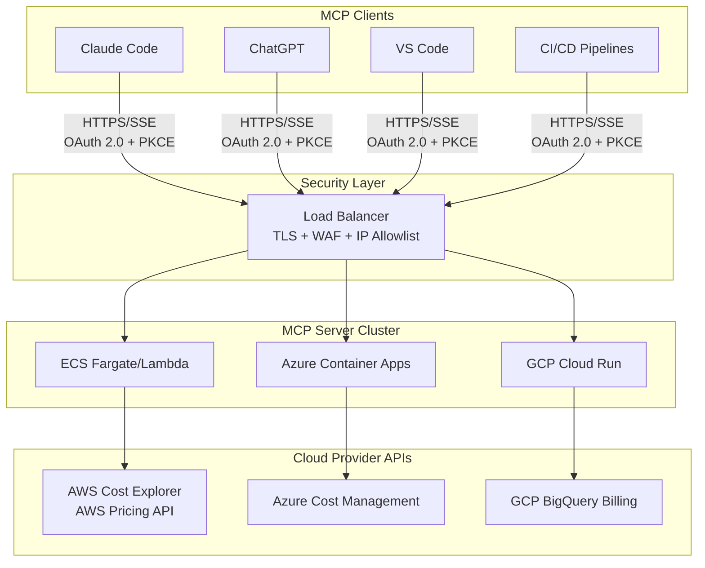
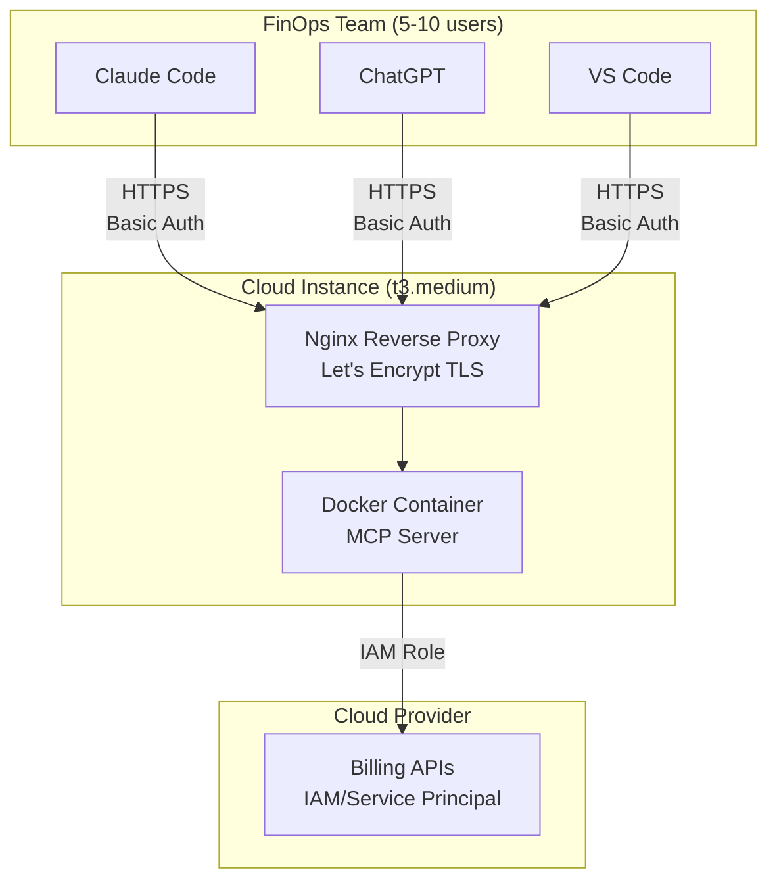
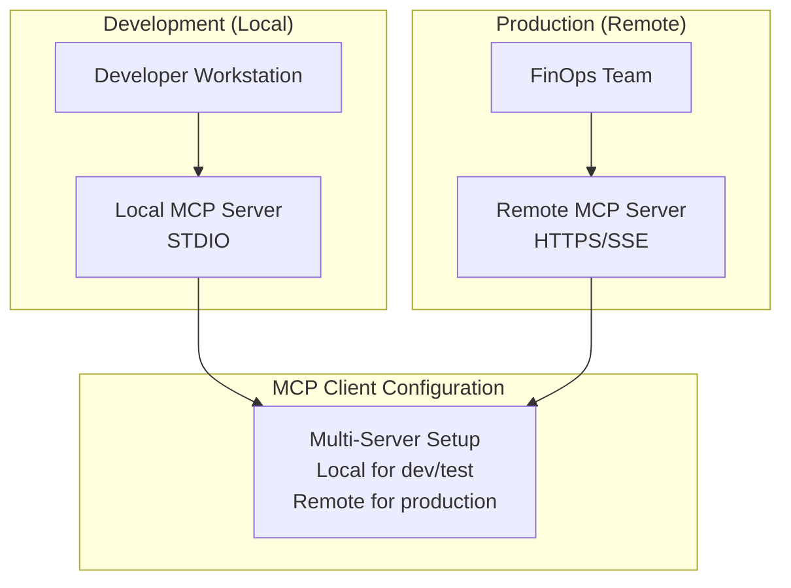

# Remote MCP Servers for FinOps

**Last Updated**: January 2026

Remote MCP servers are cloud-hosted or network-accessible MCP servers that clients connect to over HTTP/HTTPS or Server-Sent Events (SSE), as opposed to local servers running on the same machine as the MCP client.

Remote MCP support became mainstream in 2025, with Claude Code adding native support in June 2025 and other major clients following suit.

---

## 🌐 What Are Remote MCP Servers?

### Architecture Comparison: Local vs Remote



### Local MCP Servers (Traditional)

Local MCP servers run as processes on the same machine as your MCP client, typically launched via STDIO (standard input/output). When you run `npx @modelcontextprotocol/server-aws-pricing`, you're spinning up a local server that lives and dies with your session.

The advantages are clear: no network latency, simpler authentication, and zero hosting costs. But the tradeoffs are significant for teams. Every developer needs to install and manage their own instance, configuration drifts across machines, and there's no way to share cached data or centralized policies across your organization.

### Remote MCP Servers (Modern)

Remote MCP servers flip this model by running as cloud-hosted services accessible over the network. Instead of launching a local process, your MCP client connects to something like `https://mcp.finops-corp.example.com/aws-pricing` via HTTP/HTTPS or Server-Sent Events (SSE).

The benefits are transformative for enterprises: centralized management, shared infrastructure across teams, and zero local installation requirements. The tradeoffs are infrastructure complexity and network latency, but for FinOps teams managing multi-cloud environments, the centralization benefits far outweigh the costs.

---

## ✅ Benefits of Remote MCP Servers for FinOps

### 1. Centralized Management

Remote MCP servers establish a single source of truth for your entire organization. Instead of maintaining dozens of local installations across developer machines, you update one server instance and everyone immediately benefits. This eliminates version skew, ensures consistent behavior across all users, and dramatically simplifies maintenance. From a cost perspective, running one powerful server is far more efficient than distributing compute across many local instances.

### 2. Enterprise Security

Security teams love remote MCP servers because they centralize the attack surface. Cloud credentials for AWS, Azure, and GCP live in one secure location—typically a secrets manager like AWS Secrets Manager or Azure Key Vault—rather than scattered across developer laptops. Users never need direct access to billing APIs, which means fewer IAM policies to manage and audit. All queries flow through a central logging point, giving you complete visibility for compliance. Add IP allowlisting, VPC isolation, and WAF protection, and you've got defense in depth that's impossible with local servers.

### 3. Better Performance

Remote servers enable performance optimizations that local instances can't match. Shared caching means that when one user queries AWS pricing data, everyone benefits from the cached results. Complex cost analyses run on powerful cloud instances rather than struggling on a developer's laptop. The server can batch requests, deduplicate queries, and centrally manage rate limits to avoid throttling. For distributed teams, a cloud-hosted server in a central region is often faster than running everything locally.

### 4. Team Collaboration

Remote MCP servers transform FinOps from a solo activity into a team sport. Multiple team members can query the same live data simultaneously, ensuring everyone works from identical cost figures. The 2025-11-25 MCP spec introduced cross-app access, enabling single sign-on across all your MCP servers—eliminating the authentication friction that plagued earlier implementations. Most importantly, consistent results across the team mean no more "it works on my machine" discrepancies during budget reviews.

---

## 🏗️ Architecture Patterns

### Pattern 1: Cloud-Hosted MCP Server (Recommended for Enterprises)



**Best for**: Large FinOps teams (10+ users) managing multi-account or multi-cloud environments, especially organizations with strict security and compliance requirements that demand centralized control and auditing.

---

### Pattern 2: Shared Team Server (Mid-sized Teams)



**Best for**: Small to mid-sized teams (5-10 users) just starting their remote MCP journey, or budget-conscious deployments where a simple VM or container instance provides enough capacity without enterprise-grade infrastructure.

---

### Pattern 3: Hybrid Local + Remote (Flexible)



**Best for**: Development teams that need offline access for testing, organizations transitioning from local to remote MCP architectures, or scenarios with mixed connectivity like hybrid on-premises and cloud environments.

---

## 🔧 Implementation Guide

### Step 1: Choose Your Hosting Platform

| Platform | Best For | MCP Transport | Pricing Model |
|----------|----------|---------------|---------------|
| **AWS Lambda** | Serverless, pay-per-use | HTTP | Per-request |
| **AWS ECS Fargate** | Containerized, always-on | SSE, HTTP | Per-hour |
| **Azure Container Apps** | Containerized, auto-scaling | SSE, HTTP | Per-second |
| **Azure Functions** | Serverless, pay-per-use | HTTP | Per-execution |
| **GCP Cloud Run** | Containerized, serverless | SSE, HTTP | Per-request |
| **GCP Cloud Functions** | Serverless, pay-per-use | HTTP | Per-invocation |
| **Kubernetes** | Self-managed, full control | SSE, HTTP | Infrastructure costs |
| **VM / VPS** | Simple, persistent | SSE, HTTP | Monthly flat rate |

---

### Step 2: Configure MCP Server for Remote Access

**Example: AWS Pricing MCP Server on Cloud Run (Node.js)**

```javascript
// server.js
const { Server } = require('@modelcontextprotocol/sdk/server/index.js');
const { SSEServerTransport } = require('@modelcontextprotocol/sdk/server/sse.js');
const express = require('express');

const app = express();
const server = new Server({
  name: 'aws-pricing-remote',
  version: '1.0.0',
});

// Register MCP tools (pricing queries, etc.)
server.setRequestHandler('tools/list', async () => {
  return { tools: [/* your tools */] };
});

// SSE endpoint
app.get('/sse', async (req, res) => {
  const transport = new SSEServerTransport('/message', res);
  await server.connect(transport);
});

app.post('/message', async (req, res) => {
  // Handle MCP messages
});

const PORT = process.env.PORT || 8080;
app.listen(PORT, () => {
  console.log(`Remote MCP server running on port ${PORT}`);
});
```

**Dockerfile:**
```dockerfile
FROM node:20-alpine
WORKDIR /app
COPY package*.json ./
RUN npm ci --production
COPY . .
EXPOSE 8080
CMD ["node", "server.js"]
```

---

### Step 3: Implement Authentication

**Option 1: OAuth 2.0 with PKCE (Recommended)**
```javascript
const { OAuth2Server } = require('oauth2-server');

app.use('/oauth', (req, res, next) => {
  // Implement OAuth 2.0 endpoints
  // - /oauth/authorize
  // - /oauth/token
  // - Validate PKCE code_challenge
});

app.use('/sse', authenticateOAuth, (req, res) => {
  // SSE endpoint protected by OAuth
});
```

**Option 2: API Keys (Simple, less secure)**
```javascript
const API_KEYS = process.env.MCP_API_KEYS.split(',');

app.use('/sse', (req, res, next) => {
  const apiKey = req.headers['x-api-key'];
  if (!API_KEYS.includes(apiKey)) {
    return res.status(401).json({ error: 'Unauthorized' });
  }
  next();
});
```

---

### Step 4: Deploy to Cloud

**AWS ECS Fargate Example:**
```bash
# Build and push Docker image
aws ecr get-login-password --region us-east-1 | docker login --username AWS --password-stdin <account>.dkr.ecr.us-east-1.amazonaws.com
docker build -t mcp-aws-pricing .
docker tag mcp-aws-pricing:latest <account>.dkr.ecr.us-east-1.amazonaws.com/mcp-aws-pricing:latest
docker push <account>.dkr.ecr.us-east-1.amazonaws.com/mcp-aws-pricing:latest

# Create ECS service
aws ecs create-service \
  --cluster finops-mcp \
  --service-name mcp-aws-pricing \
  --task-definition mcp-aws-pricing:1 \
  --desired-count 2 \
  --launch-type FARGATE \
  --network-configuration "awsvpcConfiguration={subnets=[subnet-xxx],securityGroups=[sg-xxx],assignPublicIp=ENABLED}" \
  --load-balancers "targetGroupArn=arn:aws:elasticloadbalancing:...,containerName=mcp-aws-pricing,containerPort=8080"
```

**GCP Cloud Run Example:**
```bash
# Build and deploy
gcloud builds submit --tag gcr.io/project-id/mcp-aws-pricing
gcloud run deploy mcp-aws-pricing \
  --image gcr.io/project-id/mcp-aws-pricing \
  --platform managed \
  --region us-central1 \
  --allow-unauthenticated  # Or use --no-allow-unauthenticated + IAM
```

---

### Step 5: Configure MCP Client

**Claude Code (.claude/mcp.json):**
```json
{
  "mcpServers": {
    "aws-pricing-remote": {
      "url": "https://mcp.finops-corp.example.com/sse",
      "transport": "sse",
      "headers": {
        "Authorization": "Bearer ${secrets:mcp-oauth-token}"
      }
    }
  }
}
```

**VS Code (settings.json):**
```json
{
  "mcp.servers": {
    "aws-pricing": {
      "type": "remote",
      "url": "https://mcp.finops-corp.example.com/sse",
      "auth": {
        "type": "oauth2",
        "tokenUrl": "https://auth.finops-corp.example.com/oauth/token",
        "clientId": "https://finops-corp.example.com/mcp-client.json"
      }
    }
  }
}
```

---

## 🔐 Security Best Practices

**Transport Security**: Always use HTTPS/TLS for remote MCP servers. Never expose servers over plain HTTP, even for internal development. The 2025-11-25 MCP specification mandates OAuth 2.0 with PKCE (Proof Key for Code Exchange) for all remote deployments, protecting against authorization code interception attacks.

**Credential Management**: Store cloud credentials in dedicated secrets managers—AWS Secrets Manager, Azure Key Vault, or GCP Secret Manager—never in environment variables or configuration files. Enable comprehensive logging via CloudTrail, Azure Monitor, or Cloud Logging to track every query for compliance and forensics.

**Network Isolation**: Implement IP allowlisting to restrict access to known corporate networks when possible. For maximum security, keep MCP servers on private VPC endpoints and require VPN or bastion access. This prevents exposure to the public internet while still enabling remote access for authorized users.

**Operational Security**: Conduct regular security audits including penetration testing and dependency scanning. Implement rate limiting to prevent abuse and protect your cloud provider API quotas from accidental or malicious overuse. These safeguards ensure your remote MCP infrastructure remains resilient against both external threats and internal misconfigurations.

---

## 💰 Cost Considerations

### Remote Server Hosting Costs

The infrastructure costs for remote MCP servers vary by deployment model. Serverless options like Lambda or Cloud Functions run $0.20-$1.00 per million requests, making them cost-effective for intermittent use. Container platforms like Cloud Run or Azure Container Apps charge $0.05-$0.15 per hour, balancing cost and performance for moderate traffic. Always-on VMs range from $20-$100 per month depending on instance size, while load balancers add $15-$25 monthly to ensure high availability.

### Cost Savings from Remote Servers

The real financial win comes from operational efficiencies. Caching and query deduplication typically reduce cloud provider API costs by 30-50%, as the server batches requests and shares results across users. Running one powerful centralized server is dramatically cheaper than provisioning equivalent compute across dozens of developer machines. Centralized optimization—like intelligent rate limiting and request coalescing—compounds these savings by reducing overall cloud spend.

**ROI estimate**: For teams of 10+ users, remote MCP servers typically pay for themselves within 1-2 months through reduced API costs and improved efficiency. The larger your team and the more cloud APIs you query, the faster the payback.

---

## 📖 Additional Resources

- [Claude Code Remote MCP Documentation](https://code.claude.com/docs/en/mcp)
- [MCP SDK - SSE Server Transport](https://github.com/modelcontextprotocol/sdk)
- [MCP Specification 2025-11-25](https://modelcontextprotocol.io/specification/2025-11-25)
- [OAuth 2.0 for MCP](https://den.dev/blog/mcp-november-authorization-spec/)
- [Remote MCP Announcement](https://www.anthropic.com/news/claude-code-remote-mcp)

---

## 🤝 Contributing

Have experience deploying remote MCP servers for FinOps? Share your learnings via Issues or PRs!
