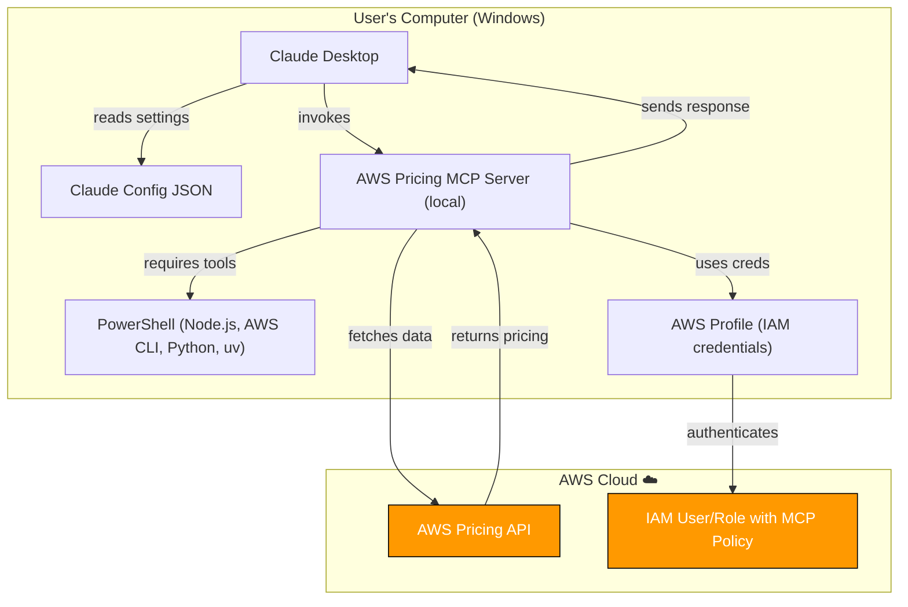

# AWS Pricing MCP Server Installation Tutorial

## Introduction

This tutorial is designed for everyone who wants to try out Model Context Protocol (MCP) servers, including non-technical users. In this tutorial, MCP servers extend Claude's capabilities by connecting it to external data sources and tools. The AWS Pricing MCP server specifically allows Claude to fetch real-time AWS pricing information and generate cost analysis reports.

We've broken down the installation process into detailed, step-by-step instructions so that anyone can successfully set it up, regardless of their technical background. Each step includes explanations of what you're doing and why, along with troubleshooting tips for common issues.

This first tutorial involves several prerequisites (Python tools, AWS CLI, etc.), but once you complete this setup, installing additional MCP servers will be much simpler since you'll already have the foundational tools configured.

*Note: This tutorial is specifically for Windows users and uses PowerShell commands.*


## See it in action

Once everything is installed, you'll be able to use natural language to get AWS pricing information and cost analysis. Here's a demo of what's possible:

[](https://www.loom.com/share/1ebf9a8de67e4a489e9b15af29dfc4f4)

*Click the image above to watch the demo video*


## Step 1: Prerequisites

Before installing the MCP server, we need to set up the basic tools and software that it depends on. These prerequisites ensure everything works smoothly during installation.RetryClaude can make mistakes. Please double-check responses.

### a. Understanding PowerShell
**Why PowerShell?**
PowerShell is Windows' built-in command-line tool for installing software and running system commands. We need it to install the AWS Pricing MCP server using Node.js package manager.

**How to open PowerShell:**
- Press Windows key + X
- Select "Windows PowerShell" or "Terminal"
- You'll see a window with white text on blue/black background


### b. Install Node.js
**What is Node.js?**
Node.js lets your computer run JavaScript programs outside web browsers. The MCP server is built with Node.js.

**Check if installed:**
In PowerShell, type:
```powershell
node --version
```

**If not installed:**
- Download from https://nodejs.org (choose LTS version)
- Run installer with default settings
- Restart PowerShell and test again


### c. Install AWS CLI
**What is AWS CLI?**
AWS CLI is Amazon's command-line tool that lets your computer connect to AWS services. The MCP server needs it to fetch pricing data.

**Install AWS CLI:**
- Download from https://aws.amazon.com/cli/
- Run installer with default settings
- Restart PowerShell after installation

**Verify installation:**
```powershell
aws --version
```

**Configure AWS user:**
AWS CLI needs a user with proper permissions to access pricing data. You can use your own AWS user or create a dedicated one. For detailed instructions on creating users and configuring access keys, see: https://github.com/OptimNow/finops-mcp-resources/blob/main/governance/security-aws-iam-policies.md


### d. Install uv (Python Package Manager)
**What is uv?**
uv is a modern Python package manager from Astral. The AWS Pricing MCP server is Python-based and requires uv.

**Install uv:**
- Download from https://docs.astral.sh/uv/getting-started/installation/ or https://github.com/astral-sh/uv#installation
- For Windows, use PowerShell:
```powershell
powershell -ExecutionPolicy ByPass -c "irm https://astral.sh/uv/install.ps1 | iex"
```
**Verify installation:**
```powershell
uv --version
```


### e. Install Python 3.10+
Install Python using uv:
```powershell
uv python install 3.10
```
Verify Python installation:
```powershell
uv python list
```
You should see Python 3.10 (or newer) in the list.


### f. Install Claude Desktop
Reference the Claude Desktop setup at: https://github.com/OptimNow/finops-mcp-resources/blob/main/clients/claude-desktop.md

---

## Step 2: Configuring the Claude Desktop json

**Understanding the config file:**
The Claude Desktop config JSON file tells Claude which MCP servers to connect to. Each entry specifies a server name and how to run it.

**Navigate to MCP configuration:**
- Open Claude Desktop
- Click your name/profile in bottom-left
- Select "Settings"
- Click "Developer" from the left menu
- Click "Edit Config" button

---

## Step 3: Configure AWS User (Choose One Option)
You will need AWS credentials to access your AWS cost data, for that you have 2 options:

### Option 1: Use Your Personal AWS User
Configure with your own credentials:
In PowerShell, run
```powershell
aws configure
```
Add the access keys that belong to your user.

Add to json config:
```json
{
  "mcpServers": {
    "awslabs.aws-pricing-mcp-server": {
      "command": "uvx",
      "args": [
        "--from",
        "awslabs.aws-pricing-mcp-server@latest",
        "awslabs.aws-pricing-mcp-server.exe"
      ],
      "env": {
        "FASTMCP_LOG_LEVEL": "ERROR",
        "AWS_PROFILE": "<your-aws-user>",
        "AWS_REGION": "us-east-1"
      },
      "disabled": false,
      "autoApprove": []
    }
  }
}
```

### Option 2: Create Dedicated User (Recommended)
For better security, create a dedicated AWS user instead of using your personal credentials. First, check your current configuration with `aws sts get-caller-identity` to see which user is currently configured. Then create a new IAM user specifically for MCP operations, attach the mcp policy, generate access keys for this user. For detailed instructions on creating users, creating and attaching the right policy, and configuring access keys, see: [AWS Security Privileges Guide](https://github.com/OptimNow/finops-mcp-resources/blob/main/governance/security-aws-iam-policies.md)

Then configure the dedicated user profile:
```powershell
aws configure --profile mcp-user
```
it will ask you to enter the access keys that you have generated for the mcp user.

Update the Claude JSON config to use the dedicated user:
```json
{
  "mcpServers": {
    "awslabs.aws-pricing-mcp-server": {
      "command": "uvx",
      "args": [
         "--from",
         "awslabs.aws-pricing-mcp-server@latest",
         "awslabs.aws-pricing-mcp-server.exe"
      ],
      "env": {
        "FASTMCP_LOG_LEVEL": "ERROR",
        "AWS_PROFILE": "<your finops mcp profile>",
        "AWS_REGION": "us-east-1"
      },
      "disabled": false,
      "autoApprove": []
    }
  }
}
```
**Save and restart:**
- Save the configuration
- Completely close Claude Desktop
- Reopen Claude Desktop

---
## Step 4: Verify MCP Server is enabled
- Open Claude Desktop
- Click on the 'Search and Tools' button next to the + button in the prompting area
- Look for "awslabs-aws-pricing-mcp-server" in the list
- Ensure the toggle is enabled (blue/on position)
- You can click on it to get more details on the APIs it calls
---

## Step 5: Test the MCP Server

Try these prompts in Claude to verify everything works:

**Basic pricing query:**
```json
What's the current pricing for EC2 m7g.large instances in us-east-1?
```
*Expected: Detailed pricing of EC2 instance*

**Regional comparison:**
```json
Compare S3 standard storage pricing between us-east-1 and eu-west-1
```
*Expected: Side-by-side pricing comparison for both regions*

**Service analysis:**

```json
Generate a cost report for my AWS amortized costs over the past 30 days, with a breakdown per service and region. Generate an html report with trend analysis and a forecast for the next quarter.
```

*Expected: Comprehensive cost analysis and forecast.*

If queries return pricing and cost data, your MCP server is working correctly.


---

**Here’s a diagram of what you’ve just set up — Claude Desktop running locally with the AWS Pricing MCP server, securely connecting to AWS through your IAM profile to fetch real-time pricing data.**


