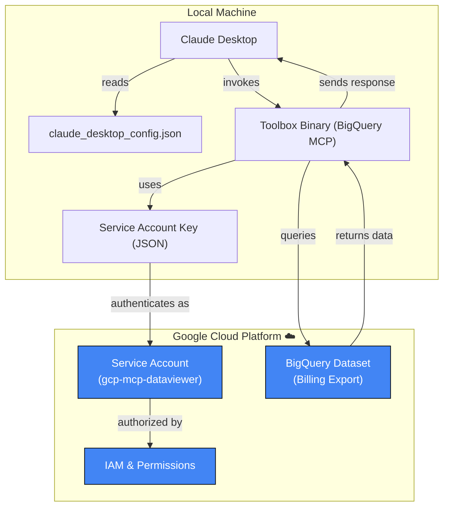

# GCP BigQuery MCP Server — Quick Start

## 1. Overview

The **GCP BigQuery MCP server** (via Toolbox) allows you to query **Google Cloud Billing Export** data directly in Claude Desktop for FinOps use cases such as:

- Cost analysis and reporting
- Spend anomaly detection
- Resource optimization insights
- Multi-cloud cost comparisons

This tutorial walks you through setting up the BigQuery MCP server using the Toolbox binary with a dedicated GCP service account.

---

## 2. Prerequisites

Before starting, ensure you have:

- **GCP Billing Export to BigQuery** enabled ([Setup Guide](https://cloud.google.com/billing/docs/how-to/export-data-bigquery))
- **Claude Desktop** installed ([Installation Guide](https://github.com/OptimNow/finops-mcp-resources/blob/main/clients/claude-desktop.md))
- **A GCP Service Account** with appropriate permissions (see below)
- **Toolbox binary** for your platform (provided or compiled from [Google's official MCP Toolbox for Databases](https://github.com/googleapis/genai-toolbox)), set up is explained below after the Service Account set up.

---

## 3. Step 1: Create and Configure GCP Service Account

### a. Create the Service Account

1. Go to [GCP Console > IAM & Admin > Service Accounts](https://console.cloud.google.com/iam-admin/serviceaccounts)
2. Select your project (e.g., `gcp-mcp-server`)
3. Click **"+ CREATE SERVICE ACCOUNT"**
4. Enter details:
   - **Name**: `gcp-mcp-dataviewer`
   - **Description**: `Service account for MCP BigQuery cost analysis`
5. Click **"CREATE AND CONTINUE"**

### b. Grant Required Roles (Project Level)

On the **"Grant this service account access to project"** screen, add these roles:
- **`BigQuery Data Viewer`** - Allows reading data from BigQuery datasets
- **`BigQuery Job User`** - Allows running queries (recommended)

**Note:** Do NOT add "Viewer" or "Billing Account Viewer" here - these are either too broad or must be assigned at a different level.

Click **"CONTINUE"** then **"DONE"**

### c. Grant Billing Account Viewer Role (Billing Account Level)

**Important:** This role must be assigned at the Billing Account level, not at the project level.

1. Go to [GCP Console > Billing](https://console.cloud.google.com/billing)
2. Select your **Billing Account** (the one linked to your billing export)
3. Click **"Account Management"** in the left sidebar
4. Click **"ADD PRINCIPAL"** (or "ADD MEMBER")
5. In the **"New principals"** field, enter your service account email:
   - Format: `gcp-mcp-dataviewer@YOUR-PROJECT-ID.iam.gserviceaccount.com`
   - You can copy this from the Service Accounts page
6. In **"Select a role"**, choose: **`Billing Account Viewer`**
7. Click **"SAVE"**

**Why this role?** The Billing Account Viewer role (`roles/billing.viewer`) allows the service account to access billing metadata and currency information required for comprehensive cost analysis.

### d. Create and Download JSON Key

1. Return to [GCP Console > IAM & Admin > Service Accounts](https://console.cloud.google.com/iam-admin/serviceaccounts)
2. Find your newly created service account in the list
3. Click on it to open details
4. Go to the **"KEYS"** tab
5. Click **"ADD KEY"** > **"Create new key"**
6. Choose **JSON** format
7. Click **"CREATE"**
8. The key file downloads automatically (e.g., `gcp-mcp-dataviewer.json`)

### e. Store the Key Securely

Create a secure directory for keys:

**macOS/Linux:**
```bash
mkdir -p ~/.config/gcloud/keys
mv ~/Downloads/gcp-mcp-dataviewer.json ~/.config/gcloud/keys/
chmod 600 ~/.config/gcloud/keys/*.json
```

**Windows (PowerShell):**
```powershell
New-Item -ItemType Directory -Force -Path "$env:USERPROFILE\Documents\keys"
Move-Item "$env:USERPROFILE\Downloads\gcp-mcp-dataviewer.json" "$env:USERPROFILE\Documents\keys\"
```

**⚠️ Important:** Never commit service account keys to Git repositories!

---

## 4. Step 2: Install Toolbox Binary

The Toolbox binary provides MCP server functionality for various data sources including BigQuery.

### macOS/Linux Installation

```bash
# Create local bin directory if it doesn't exist
mkdir -p ~/.local/bin

# Download and install toolbox (if you have the binary)
# Option 1: If binary is in your downloads or current directory
cp /path/to/toolbox ~/.local/bin/
chmod +x ~/.local/bin/toolbox

# Option 2: Download from a release (if available)
# curl -L https://github.com/stacklok/toolbox/releases/latest/download/toolbox-darwin-arm64 -o ~/.local/bin/toolbox
# chmod +x ~/.local/bin/toolbox

# Verify installation
~/.local/bin/toolbox --help
```

### Windows Installation

```bash
# Download the latest version (v0.24.0) for Windows
export VERSION=0.24.0
curl -L -o toolbox.exe "https://storage.googleapis.com/genai-toolbox/v$VERSION/windows/amd64/toolbox.exe"

# Create local bin directory and move toolbox
mkdir -p ~/.local/bin
mv toolbox.exe ~/.local/bin/

# Verify installation
~/.local/bin/toolbox.exe --help
```

**Note:** The toolbox binary will be located at `C:\Users\<your-username>\.local\bin\toolbox.exe`

---

## 5. Step 3: Configure Claude Desktop

### a. Open Claude Desktop Configuration

1. Open **Claude Desktop**
2. Click your **profile icon** (bottom-left corner)
3. Select **"Settings"**
4. Click **"Developer"** from the left menu
5. Click **"Edit Config"** button

This opens your `claude_desktop_config.json` file.

### b. Add BigQuery MCP Server Configuration

Add the following configuration to your JSON file:

**macOS/Linux:**
```json
{
  "mcpServers": {
    "bigquery": {
      "command": "/Users/<your-username>/.local/bin/toolbox",
      "args": ["--prebuilt", "bigquery", "--stdio"],
      "env": {
        "BIGQUERY_PROJECT": "your-gcp-project-id",
        "GOOGLE_APPLICATION_CREDENTIALS": "/Users/<your-username>/.config/gcloud/keys/your-key-file.json"
      }
    }
  }
}
```

**Windows:**
```json
{
  "mcpServers": {
    "bigquery": {
      "command": "C:\\Users\\<your-username>\\.local\\bin\\toolbox.exe",
      "args": ["--prebuilt", "bigquery", "--stdio"],
      "env": {
        "BIGQUERY_PROJECT": "your-gcp-project-id",
        "GOOGLE_APPLICATION_CREDENTIALS": "C:\\Users\\<your-username>\\Documents\\keys\\your-key-file.json"
      }
    }
  }
}
```

### c. Replace Placeholders

Replace these values with your actual information:
- `<your-username>`: Your system username
- `your-gcp-project-id`: Your GCP project ID (e.g., `gcp-mcp-server`)
- `your-key-file.json`: The name of your downloaded service account key file

### d. Example Configuration

Here's a complete example:

```json
{
  "mcpServers": {
    "bigquery": {
      "command": "/Users/<your-username>/.local/bin/toolbox",
      "args": ["--prebuilt", "bigquery", "--stdio"],
      "env": {
        "BIGQUERY_PROJECT": "gcp-mcp-server",
        "GOOGLE_APPLICATION_CREDENTIALS": "/Users/<your-username>/.config/gcloud/keys/your-key-file.json"
      }
    }
  }
}
```

### e. Save and Restart

1. **Save** the configuration file
2. **Completely close** Claude Desktop
3. **Reopen** Claude Desktop

---

## 6. Step 4: Verify MCP Server is Enabled

1. Open **Claude Desktop**
2. Click the **"🔌" icon** or **"Search and Tools"** button (next to the prompt input)
3. Look for **gcp-bigquery-billing** in the connectors list
4. Ensure the toggle is **enabled** (blue/on position)
5. Your setup includes 5 powerful tools:
      query_gcp_billing - Flexible queries about GCP costs
      get_gcp_cost_summary - Total cost summaries by time period
      get_gcp_costs_by_service - Service-level cost breakdown
      get_gcp_costs_by_project - Project-level cost breakdown
      get_gcp_daily_costs - Daily cost trends for analysis

---

## 7. Step 5: Test Your Setup

Try these prompts in Claude to verify everything works:

### Basic Query Test

```
Show me my total GCP costs for the last 30 days
```

*Expected: A breakdown of your GCP spending over the past month*

### Service Breakdown

```
What are my top 5 most expensive GCP services this month?
```

*Expected: A table showing top 5 most exepensive per GCP service*

### Trend Analysis

```
Analyze my GCP cost trends over the past 90 days. Show me which services have increased the most and provide a visualization
```

*Expected: Trend analysis with insights and possibly a chart*

### Cross-Region Analysis

```
Compare my GCP costs across all regions for the last month. Which region is most expensive?
```

*Expected: Regional cost breakdown with comparison*

---

## 8. Troubleshooting

### Issue: "Unable to find default Google Cloud credentials"

**Solution:** 
- Verify the `GOOGLE_APPLICATION_CREDENTIALS` path is correct
- Ensure the JSON key file exists at that location
- Check file permissions (should be readable by your user)

### Issue: "Permission denied" errors when querying

**Solution:**
- Verify your service account has `roles/bigquery.dataViewer` on the billing export dataset
- Check that billing export is enabled and data exists in BigQuery

### Issue: "Toolbox not found" or "Command not found"

**Solution:**
- Verify toolbox is installed: `ls -la ~/.local/bin/toolbox`
- Check the path in your config matches the installation location
- Ensure the binary is executable: `chmod +x ~/.local/bin/toolbox`

### Issue: MCP server doesn't appear in Claude

**Solution:**
- Check Claude logs: `~/Library/Logs/Claude/mcp-server-bigquery.log` (macOS)
- Verify JSON syntax is valid (no trailing commas, proper brackets)
- Restart Claude Desktop completely (quit from menu bar, not just close window)

---

## 9. Security Best Practices

1. **Least Privilege**: Only grant the minimum required permissions to your service account
2. **Key Rotation**: Rotate service account keys regularly (every 90 days recommended)
3. **Secure Storage**: Never store keys in version control or public locations
4. **Audit Access**: Regularly review service account usage in GCP audit logs
5. **Use Separate Accounts**: Create dedicated service accounts for different purposes

For more details, see our [GCP Security Guide](../governance/security-privileges-gcp.md) (if available).

---

## 10. Architecture Diagram

Here's what you've just set up:



---

## 11. Next Steps

- **Explore More Queries**: Try complex aggregations and cost forecasting
- **Combine with Other MCPs**: Use alongside AWS or Azure MCP servers for multi-cloud analysis
- **Automate Reports**: Create recurring cost analysis reports with Claude
- **Set Up Alerts**: Monitor for cost anomalies and optimization opportunities

For more GCP MCP server details, see the [GCP MCP Server Documentation](../servers/gcp.md).

---

## Additional Resources

- [GCP Billing Export Setup](https://cloud.google.com/billing/docs/how-to/export-data-bigquery)
- [GCP Service Account Best Practices](https://cloud.google.com/iam/docs/best-practices-service-accounts)
- [BigQuery Cost Optimization](https://cloud.google.com/bigquery/docs/best-practices-costs)
- [MCP Architecture Overview](../foundations/mcp-architecture.md)

