← [Back to Tutorials](./INDEX.md) | [Home](../README.md)

---

# GCP Billing Export MCP Server Installation Tutorial

**Tutorial 6 of 7** | ⏱️ **Time**: 35-45 minutes | 💻 **Level**: Intermediate

**Last Updated**: January 2026

---

## 🎯 What You'll Learn

- Build and install the community GCP Billing Export MCP server from source
- Configure the server with VS Code (Gemini Code Assist)
- Set up the server with Google Gemini CLI
- Query BigQuery billing data using natural language across multiple AI clients
- Customize MCP server implementation for specific FinOps workflows

---

## Introduction

This tutorial walks you through setting up the **krzko/google-cloud-mcp** community MCP server, which enables you to query your GCP billing data directly from BigQuery using AI clients like VS Code (Gemini Code Assist) and Google Gemini.

Unlike Google's official MCP servers (BigQuery, GKE, GCE, Google Maps), this community server is specifically optimized for **FinOps use cases** — analyzing cloud costs, generating billing reports, and identifying optimization opportunities.

### Choosing Between Official and Community GCP MCP Servers

There are two approaches to accessing GCP billing data through MCP servers:

**Official MCP Server:** Uses Google's [MCP Toolbox for Databases](https://github.com/googleapis/genai-toolbox) with the `--prebuilt bigquery` option. This is a production-ready, officially maintained solution that works with Claude Desktop and requires minimal setup. You install a single binary and configure it with your GCP credentials. [See Tutorial 05](./05-gcp-bigquery-quickstart.md)

**Community MCP Server (This Tutorial):** Uses the [krzko/google-cloud-mcp](https://github.com/krzko/google-cloud-mcp) community project, which requires building from source with Node.js and pnpm. This approach offers more customization options and works with multiple AI clients (VS Code, Google Gemini) but requires more setup steps.

| Feature | Official (Toolbox) | Community (krzko) |
|---------|-------------------|-------------------|
| **Maintenance** | Google-maintained | Community-maintained |
| **Installation** | Single binary download | Build from source (Node.js) |
| **Setup Complexity** | Low (3 steps) | Medium (5+ steps) |
| **Production Ready** | ✅ Yes | ⚠️ Beta |
| **Claude Desktop** | ✅ Native support | ✅ Supported |
| **VS Code/Gemini** | ❌ Not applicable | ✅ Supported |
| **Customization** | Pre-built tools | Full source access |
| **Updates** | Automatic with new releases | Manual rebuild required |

**Recommendation:** Start with the official Toolbox approach ([Tutorial 05](./05-gcp-bigquery-quickstart.md)) for production use with Claude Desktop. Consider the community server (this tutorial) if you need multi-client support or want to customize the implementation.

---

**What you'll learn:**
- How to install and build the GCP Billing Export MCP server
- How to configure it with VS Code (Gemini Code Assist)
- How to configure it with Google Gemini
- How to query your GCP billing data using natural language

**Prerequisites you'll need:**
- A GCP project with Billing Export to BigQuery enabled
- `gcloud` CLI installed and authenticated
- Node.js and `pnpm` package manager
- VS Code with Gemini Code Assist extension (optional)
- Access to Google Gemini (optional)

*Note: This tutorial includes instructions for both Windows (PowerShell) and Linux/Mac (bash).*

---

## Step 1: Prerequisites

### a. Enable GCP Billing Export to BigQuery

**What is Billing Export?**
GCP Billing Export automatically sends your billing data to a BigQuery dataset, where it can be queried and analyzed. The MCP server reads from this dataset.

**Check if already enabled:**
1. Go to [Google Cloud Console](https://console.cloud.google.com)
2. Navigate to **Billing** → **Billing Export**
3. Look for **BigQuery export** section

**If not enabled, follow this guide:**
- [Enable Billing Export to BigQuery](https://cloud.google.com/billing/docs/how-to/export-data-bigquery)


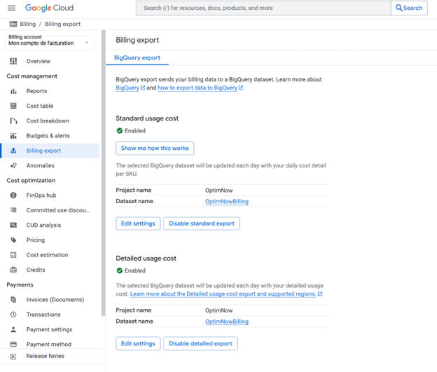

*Expected: Billing Export configured with a BigQuery dataset*

---

### b. Install Google Cloud CLI (`gcloud`)

**What is gcloud CLI?**
The Google Cloud CLI lets you manage GCP resources from the command line and authenticate your MCP server.

**Check if installed:**

**Windows PowerShell:**
```powershell
gcloud --version
```

**Linux/Mac:**
```bash
gcloud --version
```

**If not installed:**
- Download from: [https://cloud.google.com/sdk/docs/install](https://cloud.google.com/sdk/docs/install)
- Run installer with default settings
- Restart your terminal after installation


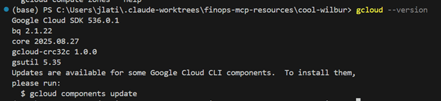

---

### c. Authenticate with Google Cloud

**Why authenticate?**
The MCP server needs permissions to access your BigQuery billing data.

**Authenticate using Application Default Credentials (ADC):**

**Windows PowerShell / Linux / Mac:**
```bash
gcloud auth application-default login
```

This will open your browser to sign in with your Google account. Grant the requested permissions.

**Verify authentication:**
```bash
gcloud auth application-default print-access-token
```

**Expected:** A valid access token is printed.


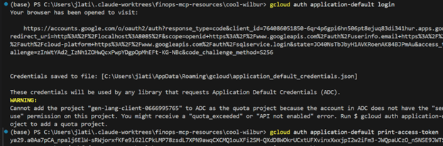

---

### d. Set Active GCP Project

**Why set a project?**
The MCP server needs to know which GCP project contains your billing export dataset.

**List your projects:**
```bash
gcloud projects list
```

**Set your active project:**
```bash
gcloud config set project YOUR_PROJECT_ID
```

**Important:** Use a project where you have **Owner** or **Editor** permissions, or at least:
- `roles/billing.viewer`
- `roles/bigquery.dataViewer` on the billing export dataset

**If you encounter permission errors:**
- Try using your "Default Gemini Project" (often named `gen-lang-client-*`)
- Or create a dedicated project for MCP operations


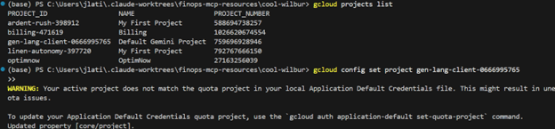

---

### e. Enable Required APIs

**Enable BigQuery API:**
```bash
gcloud services enable bigquery.googleapis.com
```

**Verify API is enabled:**

**Windows PowerShell:**
```powershell
gcloud services list --enabled | Select-String bigquery
```

**Linux/Mac:**
```bash
gcloud services list --enabled | grep bigquery
```


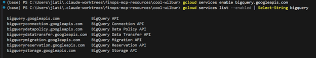

---

### f. Install Node.js and pnpm

**What is Node.js?**
Node.js is required to build and run the MCP server.

**What is pnpm?**
pnpm is a fast, disk-efficient package manager for Node.js projects.

**Check if Node.js is installed:**
```bash
node -v
npm -v
```

**If not installed:**
- Download from: [https://nodejs.org](https://nodejs.org) (choose LTS version)
- Run installer with default settings
- Restart terminal

**Install pnpm:**
```bash
npm install -g pnpm
```

**Verify pnpm installation:**
```bash
pnpm -v
```


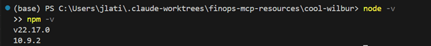

---

## Step 2: Install GCP Billing Export MCP Server

### a. Clone the Repository

**Why clone?**
This community MCP server is not available via `npm` or `uvx`. You need to clone the source code and build it locally.

**Clone the repository:**
```bash
git clone https://github.com/krzko/google-cloud-mcp.git
cd google-cloud-mcp
```


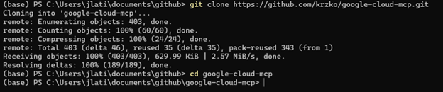

---

### b. Install Dependencies

**Install dependencies using pnpm:**
```bash
pnpm install
```

**Expected:** Dependencies are installed without errors.


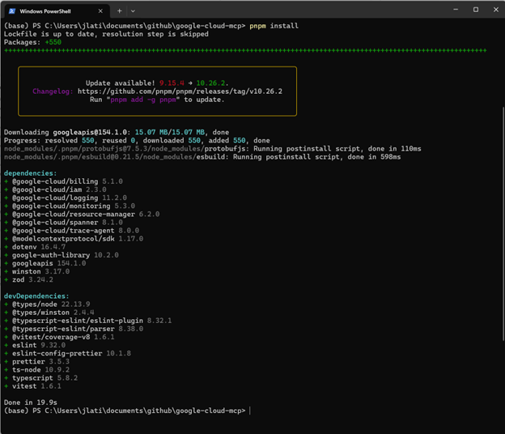

---

### c. Build the MCP Server

**Build the server:**
```bash
pnpm build
```

**Expected:** Build completes successfully, creating a `dist/` directory with compiled JavaScript files.

**Verify build output:**

**Windows PowerShell:**
```powershell
Get-ChildItem dist
```

**Linux/Mac:**
```bash
ls -la dist
```

You should see `index.js` and other compiled files.


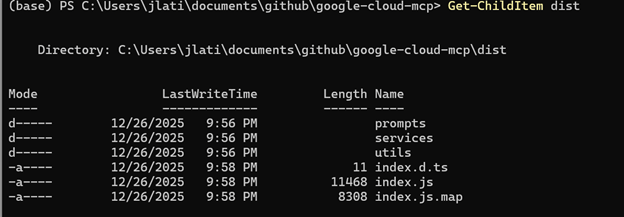

---

## Step 3: Configure with VS Code (Gemini Code Assist)

**What is Gemini Code Assist?**
Gemini Code Assist is a VS Code extension that integrates Google Gemini into your IDE, providing AI-powered code suggestions and assistance.

### a. Install Gemini Code Assist Extension

1. Open **VS Code**
2. Go to Extensions (Ctrl+Shift+X or Cmd+Shift+X)
3. Search for **"Gemini Code Assist"**
4. Click **Install**


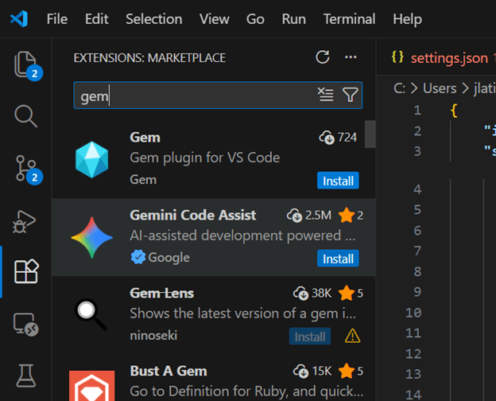

---

### b. Open VS Code Settings JSON

**Open User Settings (JSON):**
1. Press `Ctrl+Shift+P` (or `Cmd+Shift+P` on Mac)
2. Type **"Open User Settings (JSON)"**
3. Press Enter


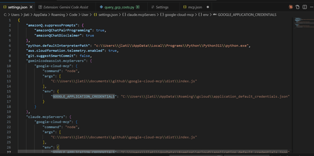

---

### c. Add MCP Server Configuration

**Add the following configuration to your `settings.json`:**

Replace `<your-user>` with your actual username (the path where you cloned the repository).

```json
{
  "geminicodeassist.mcpServers": {
    "google-cloud-mcp": {
      "command": "node",
      "args": [
        "/Users/<your-user>/code/google-cloud-mcp/dist/index.js"
      ],
      "env": {
        "GOOGLE_APPLICATION_CREDENTIALS": "/Users/<your-user>/.config/gcloud/application_default_credentials.json"
      }
    }
  }
}
```

**For Windows users:**
- Use Windows path format: `C:\\Users\\<your-user>\\code\\google-cloud-mcp\\dist\\index.js`
- ADC path: `C:\\Users\\<your-user>\\AppData\\Roaming\\gcloud\\application_default_credentials.json`

**Example for Windows:**
```json
{
  "geminicodeassist.mcpServers": {
    "google-cloud-mcp": {
      "command": "node",
      "args": [
        "C:\\Users\\jean\\code\\google-cloud-mcp\\dist\\index.js"
      ],
      "env": {
        "GOOGLE_APPLICATION_CREDENTIALS": "C:\\Users\\jean\\AppData\\Roaming\\gcloud\\application_default_credentials.json"
      }
    }
  }
}
```


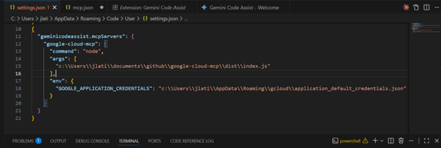

---

### d. Reload VS Code

**Reload VS Code to activate the MCP server:**
1. Press `Ctrl+Shift+P` (or `Cmd+Shift+P`)
2. Type **"Reload Window"**
3. Press Enter

Or simply restart VS Code.


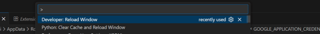

---

### e. Verify MCP Server is Active

**Check Gemini Code Assist output:**
1. Open the **Output** panel (`Ctrl+Shift+U` or `Cmd+Shift+U`)
2. Select **"Gemini Code Assist"** from the dropdown
3. Look for messages indicating the MCP server has connected

**Expected:** You should see logs about `google-cloud-mcp` initialization.


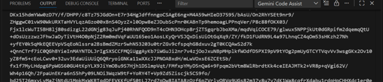

---

### f. Test MCP Server in VS Code

**Open a new file or chat with Gemini in VS Code:**

Try this query:
```
What are my top 5 GCP services by cost over the past 30 days?
```

**Expected:** Gemini queries your BigQuery billing export and returns cost data.


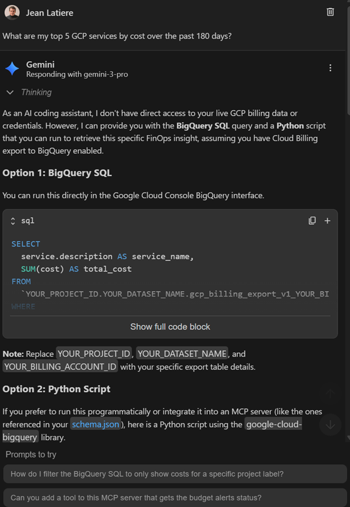

---

## Step 4: Configure with Google Gemini (Web/Desktop)

**What is Google Gemini?**
Google Gemini is Google's conversational AI platform, available via web interface and desktop app.

**Important:** Gemini supports MCP through the **Gemini CLI** or **Vertex AI**. For consumer Gemini (gemini.google.com), MCP support is limited and primarily available through the API.

This section covers configuration through the **Gemini CLI** (terminal-based agent).

---

### a. Install Gemini CLI (if not already installed)

**What is Gemini CLI?**
The Gemini CLI is an open-source agent that runs in your terminal and supports MCP natively.

**Install Gemini CLI:**
```bash
npm install -g @google/gemini-cli
```

**Verify installation:**
```bash
gemini --version
```


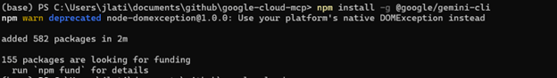

---

### b. Create Gemini MCP Configuration File

**Create Gemini config directory:**

**Windows PowerShell:**
```powershell
New-Item -Path "$env:USERPROFILE\.gemini" -ItemType Directory -Force
```

**Linux/Mac:**
```bash
mkdir -p ~/.gemini
```

**Create or edit `settings.json`:**

**Windows PowerShell:**
```powershell
notepad $env:USERPROFILE\.gemini\settings.json
```

**Linux/Mac:**
```bash
nano ~/.gemini/settings.json
```


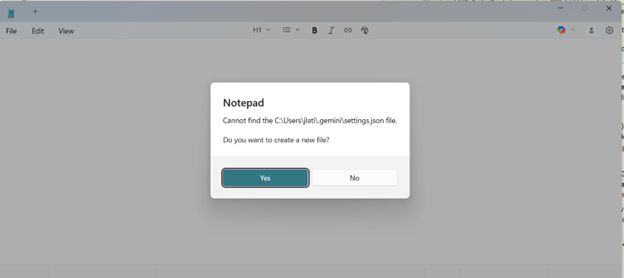

---

### c. Add MCP Server Configuration

**Add the following configuration:**

Replace `<your-user>` with your actual username.

**Linux/Mac:**
```json
{
  "mcpServers": {
    "google-cloud-mcp": {
      "command": "node",
      "args": [
        "/Users/<your-user>/code/google-cloud-mcp/dist/index.js"
      ],
      "env": {
        "GOOGLE_APPLICATION_CREDENTIALS": "/Users/<your-user>/.config/gcloud/application_default_credentials.json"
      }
    }
  }
}
```

**Windows:**
```json
{
  "mcpServers": {
    "google-cloud-mcp": {
      "command": "node",
      "args": [
        "C:\\Users\\<your-user>\\code\\google-cloud-mcp\\dist\\index.js"
      ],
      "env": {
        "GOOGLE_APPLICATION_CREDENTIALS": "C:\\Users\\<your-user>\\AppData\\Roaming\\gcloud\\application_default_credentials.json"
      }
    }
  }
}
```

**Save the file.**


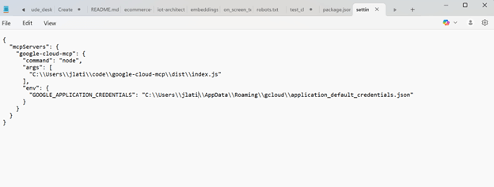

---

### d. Start Gemini CLI

**Run Gemini:**
```bash
gemini
```

**Expected:** Gemini CLI starts and loads the MCP server.

**Verify MCP server is active:**
```
/mcp list
```

You should see `google-cloud-mcp` in the list of available MCP servers.


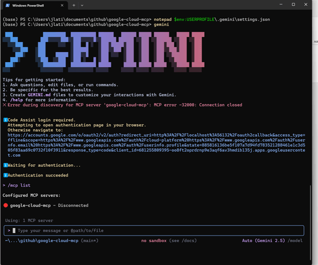

---

### e. Test MCP Server with Gemini

**Try these queries in Gemini CLI:**

**Query 1: Top services by cost**
```
What are my top 5 GCP services by cost in the last 30 days?
```

**Query 2: Cost trends**
```
Show me a cost trend for Compute Engine over the past 90 days
```

**Query 3: Regional breakdown**
```
Break down my GCP costs by region for the current month
```

**Expected:** Gemini queries your BigQuery billing export and returns cost analysis.

**Screenshot placeholder:**
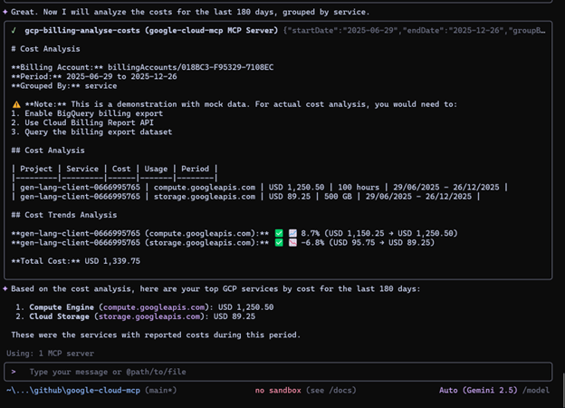

---

## Step 5: Troubleshooting Common Issues

### Issue 1: Package Not Found

**Error:**
```
npm error 404 Not Found - GET https://registry.npmjs.org/@google%2fmcp-server-compute
```

**Solution:**
This tutorial uses the **community server** `krzko/google-cloud-mcp`, not the official Google servers. Ensure you cloned the correct repository from `https://github.com/krzko/google-cloud-mcp`.

---

### Issue 2: Permission Denied on GCP APIs

**Error:**
```
ERROR: (gcloud.services.enable) PERMISSION_DENIED: Permission denied to enable service [bigquery.googleapis.com]
```

**Solution:**
1. Verify you're using a project where you have **Owner** or **Editor** permissions:
   ```bash
   gcloud projects get-iam-policy YOUR_PROJECT_ID \
     --flatten="bindings[].members" \
     --filter="bindings.members:user:YOUR_EMAIL"
   ```

2. Try using your "Default Gemini Project":
   ```bash
   gcloud projects list
   # Look for project with name like "gen-lang-client-*"
   gcloud config set project gen-lang-client-XXXXXXXX
   ```

3. If needed, create a new project for MCP operations with sufficient permissions.

---

### Issue 3: Authentication Expired

**Error:**
```
ERROR: (gcloud.auth.application-default.print-access-token) There was a problem refreshing your credentials
```

**Solution:**
Re-authenticate:
```bash
gcloud auth application-default login
```

---

### Issue 4: MCP Server Not Connecting in VS Code

**Solution:**
1. Check VS Code Output panel for errors:
   - Open Output (`Ctrl+Shift+U`)
   - Select "Gemini Code Assist" from dropdown
   - Look for connection errors

2. Verify paths in `settings.json` are correct (use absolute paths)

3. Ensure `dist/index.js` exists:
   ```bash
   ls google-cloud-mcp/dist/index.js
   ```

4. Reload VS Code window:
   - Press `Ctrl+Shift+P`
   - Type "Reload Window"

---

### Issue 5: No Billing Data Returned

**Solution:**
1. Verify Billing Export is enabled and has data:
   - Go to [BigQuery Console](https://console.cloud.google.com/bigquery)
   - Check your billing export dataset
   - Run a test query:
     ```sql
     SELECT * FROM `your-project.billing_dataset.gcp_billing_export_v1_*`
     LIMIT 10
     ```

2. Ensure you're querying the correct project and dataset

3. Check IAM permissions:
   - You need `roles/bigquery.dataViewer` on the billing dataset
   - You need `roles/billing.viewer` on the billing account

---

## Step 6: Understanding the Architecture

Here's what you've just set up — an MCP server connecting your AI client (VS Code or Gemini) to your GCP billing data in BigQuery:

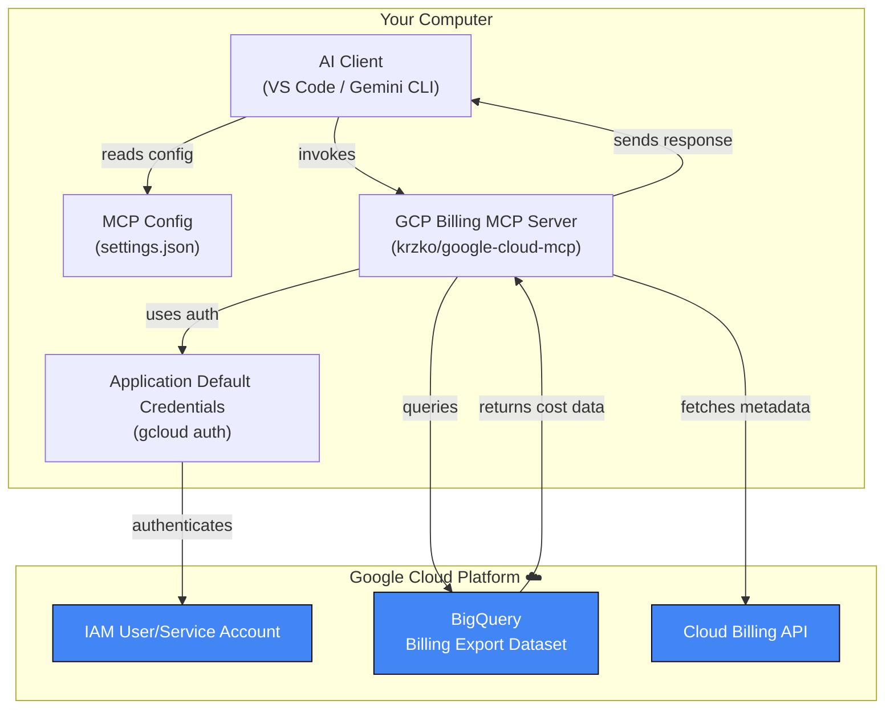

---

## Next Steps

**Now that your GCP Billing MCP server is set up, you can:**

1. **Build Custom FinOps Reports**
   - Monthly cost summaries by service
   - Cost anomaly detection
   - Budget vs actual analysis

2. **Integrate with Other MCP Servers**
   - Combine GCP billing data with AWS Cost Explorer
   - Cross-cloud cost comparison
   - Multi-cloud FinOps dashboards

3. **Automate Cost Optimization**
   - Identify underutilized resources
   - Generate rightsizing recommendations
   - Track savings from optimizations

4. **Explore Other Google MCP Servers**
   - [Official Google MCP Servers](https://github.com/Google/mcp) (BigQuery, GKE, GCE, Google Maps)
   - Combine billing data with Compute Engine metrics
   - Analyze Kubernetes cluster costs

---

## Related Resources

- [GCP MCP Servers Documentation](../servers/gcp.md)
- [Google Gemini Client Guide](../clients/gemini.md)
- [VS Code with Gemini Code Assist](../clients/vscode.md)
- [MCP Security Best Practices](../governance/security-best-practices-2025.md)
- [Getting Started with MCP](../foundations/getting-started.md)
- [krzko/google-cloud-mcp GitHub Repository](https://github.com/krzko/google-cloud-mcp)

---

**Congratulations! 🎉**

You've successfully set up the GCP Billing Export MCP server with both VS Code and Google Gemini. You can now leverage AI to analyze your GCP costs, generate reports, and identify optimization opportunities using natural language queries.

---

**Having issues?** Check the [Troubleshooting](#step-5-troubleshooting-common-issues) section above or open an issue on the [finops-mcp-resources repository](https://github.com/OptimNow/finops-mcp-resources/issues).
